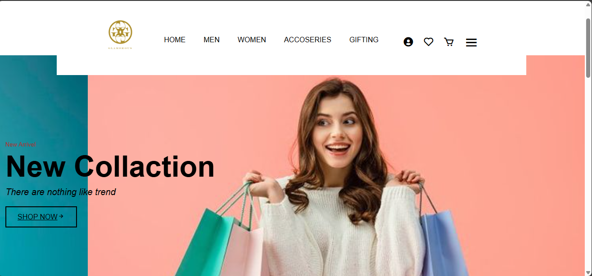

# Online Fashion Store

Welcome to the **Online Fashion Store** project! This repository contains the source code and assets for a web-based fashion store, including user authentication, product browsing, cart management, billing, reviews, and more.

## Features
- User and admin authentication (login/signup)
- Product catalog and details
- Shopping cart and checkout
- Billing information management
- Customer reviews and ratings
- FAQ and contact pages
- Admin management for users and products

## Technologies Used
- **Frontend:** HTML, CSS, JavaScript
- **Backend:** PHP
- **Database:** MySQL (SQL scripts included)

## Project Structure
- `IWT/`
	- `Assets/images/` – Image assets for the website
	- `CSS/` – Stylesheets
	- `JS/` – JavaScript files
	- `PHP/` – PHP backend scripts
	- SQL files for database setup

## Home Page Preview

## Getting Started
1. Clone the repository.
2. Set up your web server (e.g., XAMPP, WAMP) and place the project files in the web root.
3. Import the SQL files in your MySQL database.
4. Update database connection settings in `IWT/PHP/connection.php` as needed.
5. Access the site via your local server.

## License
This project is for educational purposes.

